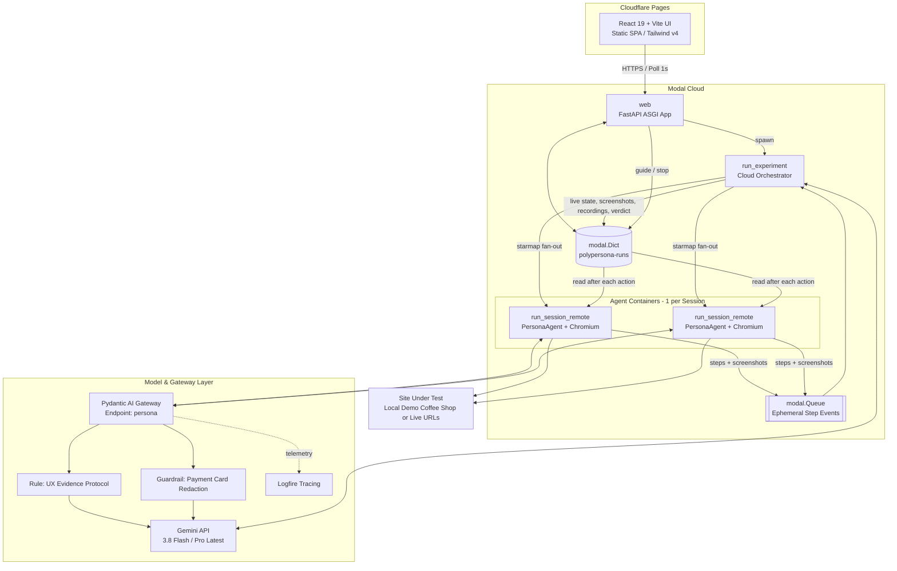
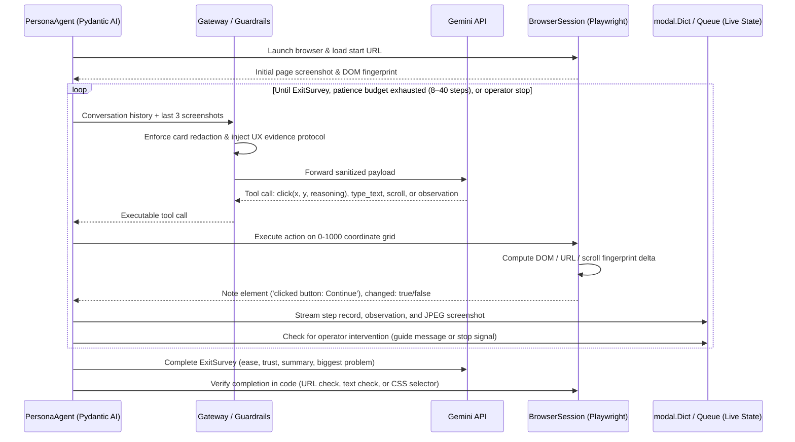

<p align="center">
  
</p>

<h1 align="center">PolyPersona</h1>

<p align="center">
  <strong>Autonomous AI Persona Panels for Website &amp; UX A/B Testing</strong><br />
  <em>Real browsers. Diverse customer personas. Empirical friction detection. Evidence-backed verdicts.</em>
</p>

<p align="center">
  <a href="https://polypersona.pages.dev"><strong>Live Web App</strong></a> &bull;
  <a href="https://shehrum--polypersona-web.modal.run"><strong>Modal Cloud API</strong></a> &bull;
  <a href="docs/ARCHITECTURE.md"><strong>Architecture Guide</strong></a>
</p>

---

## Overview

**PolyPersona** runs panels of synthetic AI persona agents against one or two variants of any live website. Each agent embodies a distinct human persona with defined digital savviness, demographic context, reading behavior, device preferences, and a finite budget of patience.

Operating inside isolated cloud containers with real Chromium browsers, persona agents navigate your site, attempt assigned user goals, think out loud, and capture real-time observations of friction, bugs, confusion, and delight. After the test runs, an AI Evaluator synthesizes metrics computed deterministically in code alongside screenshot evidence to declare an empirical winner, highlight core friction areas, and provide actionable UX recommendations.

| Browser Automation | Behavioral Personas | Evidence Engine |
| :--- | :--- | :--- |
| **Playwright + async**<br>Normalized 0–1000 coordinate grid<br>In-process DOM change detection | **Calibrated patience**<br>Hard action budgets (8–40 steps)<br>Device profiles & reading styles | **Dead-click detection**<br>Backtracks & session friction<br>Visual filmstrips & video replays |

---

## System Architecture

PolyPersona cleanly decouples responsibilities across three runtimes:



### Agent Session Execution Loop

Each persona session runs in an isolated container with its own Chromium browser instance:



```
                            ┌────────────────────────┐
                            │    Cloudflare Pages    │
                            │   React 19 + Vite UI   │
                            └───────────┬────────────┘
                                        │ HTTPS / Polling (1s)
                                        ▼
┌────────────────────────────────────────────────────────────────────────┐
│                             Modal Cloud                                │
│                                                                        │
│   ┌────────────────────────────────────────────────────────────────┐   │
│   │               FastAPI ASGI Endpoint (modal_app.py)             │   │
│   └───────────────┬───────────────────────────────┬────────────────┘   │
│                   │ spawns                        │ reads/writes       │
│                   ▼                               ▼                    │
│   ┌───────────────────────────────┐     ┌──────────────────────────┐   │
│   │ Cloud Orchestrator (execute)  │◄───►│ modal.Dict (Shared State)│   │
│   └───────────────┬───────────────┘     └──────────────┬───────────┘   │
│                   │ starmap fan-out                    │               │
│                   ▼                                    │ reads control │
│   ┌───────────────────────────────┐                    │ (guide/stop)  │
│   │ Remote Agent Container (×N)   │────────────────────┘               │
│   │ ├─ Playwright + Chromium      │                                    │
│   │ ├─ Pydantic AI PersonaAgent   │────► modal.Queue (Step Events)     │
│   │ └─ Change Detection & Cursor  │                                    │
│   └───────────────┬───────────────┘                                    │
└───────────────────┼────────────────────────────────────────────────────┘
                    │ LLM calls / Tracing
                    ▼
┌────────────────────────────────────────────────────────────────────────┐
│                        Model & Gateway Layer                           │
│                                                                        │
│  Direct: Gemini API (gemini-3.8-flash / gemini-pro-latest)             │
│  Gateway: Pydantic AI Gateway                                          │
│   ├── Endpoint: persona                                                │
│   ├── Rule: UX Evidence Protocol (System Message Injection)           │
│   ├── Guardrail: Payment Card Number (Network-level Redaction)         │
│   └── Telemetry: Logfire Tracing per session                           │
└────────────────────────────────────────────────────────────────────────┘
```

### Component Breakdown

| Layer | Technology | Responsibilities |
|---|---|---|
| **Frontend UI** (`website/`) | React 19, TypeScript, Vite, Tailwind CSS v4, React Router 8 | Interactive dashboard, workspace test history, live agent monitor with scrubber & live nudging, persona directory & CSV population importer, and cross-session insights. |
| **Cloud Backend** (`modal_app.py`, `polypersona/cloud.py`) | Modal Functions, FastAPI ASGI | Authentication (HMAC session tokens), run lifecycle orchestration, asynchronous task dispatching, live event streaming, and state storage via `modal.Dict`. |
| **Agent Execution Engine** (`polypersona/`) | Playwright, Pydantic AI, Python 3.12 | Headless Chromium automation, normalized 0–1000 coordinate vision-based actions, DOM/state fingerprinting, action budget tracking, and real-time step streaming. |
| **Evaluation Engine** (`polypersona/evaluator.py`, `metrics.py`) | Pydantic AI, Gemini Pro | Deterministic metrics calculation (completion rates, dead clicks, backtrack count, duration, ease/trust scores) combined with multimodal evidence-based judging. |
| **Gateway & Guardrails** (`scripts/`, `polypersona/llm.py`) | Pydantic AI Gateway, Logfire | UX evidence protocol optimization rule, automated credit card redaction guardrail, and telemetry tracking. |
| **Demo Target** (`site/`) | Vanilla JS, CSS, HTML | Self-contained multi-variant coffee shop (`a`: clean guest checkout, `b`: dark patterns & bugs, `c`: fast subscription redesign) running locally inside agent containers without external hosting. |

---

## Core Features

### 1. Human-Calibrated Persona Panel
- **Patience Budgets:** Hard limits on browser actions (8 to 40 steps) based on digital confidence. When patience runs out, agents genuinely abandon the cart or flow.
- **Reading Profiles:** Skimmers scan headlines, buttons, and callouts; careful readers digest body copy, terms, and notices.
- **Device & Viewport Clamping:** Tests on desktop (1280×800) or mobile (390×844) viewports, including customer-specific dimensions extracted from CRM data.
- **Audience & CRM Ingestion:** Import real customer lists from CSV (`polypersona/population.py`) or generate targeted demographic cohorts via Gemini.

### 2. Vision-Based Browser Navigation
- **Normalized 0–1000 Grid:** The agent addresses screen elements using relative coordinates against screenshots, independent of underlying resolution.
- **DOM & State Fingerprinting:** Detects whether an action triggered genuine DOM, URL, scroll, focus, or form changes. Clicks with zero state delta are flagged as **dead clicks**.
- **In-Flight Guidance & Interventions:** Operators can view live screens, inject guidance ("a friend looking over your shoulder suggests..."), or issue emergency stops.
- **Automated Cursor & Video Generation:** Recorded Playwright sessions produce smooth `.webm` replays with visible action markers (hidden from the agent's prompt to avoid bias).

### 3. Pydantic AI Gateway, Rules & Guardrails
- **UX Evidence Protocol:** A Gateway optimization rule injected into the system prompt that forces observations to cite the exact on-screen label or button in quotes (`"Button" — problem`). Yields 100% quoted UI text and improves recall of planted UX flaws.
- **Zero-Leak Payment Guardrail:** Redacts credit card patterns (`\b(?:\d[ -]?){12,18}\d\b`) at the network gateway boundary before requests hit the model. Browser tools inject test credentials locally, allowing checkout completion without exposing sensitive numbers to LLMs.
- **Full Observability:** End-to-end tracing in Logfire for every session, model call, and tool execution.

### 4. Deterministic Metrics & Evidence-Backed Verdicts
- **Numbers in Code, Words from the Model:** Completion rates, durations, dead clicks, backtracks, and severity distributions are computed deterministically in `metrics.py`.
- **Grounded Critic:** The Evaluator agent references specific sessions and steps (`session_id#step_idx`) for every reported issue and inspects screenshots before making claims.

---

## Partner technologies: what we used and where

Every item below is used in the code in this repository. Paths point to the files that do it.

### Modal: the compute layer (one cloud container per AI persona)

Every persona session runs in **its own Modal container**, with a real Chromium browser and the agent together. Modal also runs the cloud orchestrator and hosts the HTTP API that the UI calls.

| Modal feature | What we use it for | Where |
|---|---|---|
| `modal.Image` | A custom image with Pydantic AI, Logfire, Playwright and **Chromium preinstalled**, plus our demo shop and Python package, so every container starts ready to browse | `modal_app.py` |
| `@app.function` (`run_session_remote`) | **One isolated container per persona × variant × repeat.** The agent and the browser run in it, and the report, screenshots and screen recording are returned | `modal_app.py` |
| `.starmap.aio(...)` | Runs the whole matrix in parallel (up to `max_containers=20`), yielding each session as it finishes | `polypersona/orchestrator.py` |
| `modal.Queue.ephemeral()` | Every step and screenshot **streams out of the containers live**, so the dashboard updates while agents are still browsing | `polypersona/orchestrator.py`, `modal_app.py` |
| `modal.Dict` (`polypersona-runs`) | Shared run state that every container and the API can read: live progress, screenshots, reports, the test index, and messages from an observer to guide or stop an agent | `polypersona/cloud.py`, `polypersona/live.py` |
| `run_experiment` + `.spawn.aio()` | Starting a test from the UI launches the **whole run in the cloud**; no laptop needs to stay on | `modal_app.py`, `polypersona/cloud.py` |
| `@modal.asgi_app()` + `@modal.concurrent` | The FastAPI **HTTP API** for the React UI (tests, live state, screenshots, recordings, the evaluator's Q&A, persona generation), 50 requests per container, scaling to zero | `modal_app.py`, `polypersona/cloud.py` |
| `modal.Secret.from_dotenv` | Sends the keys (Gemini, Gateway, Logfire) to the containers without putting them in the image | `modal_app.py` |

```python
@app.function(secrets=secrets, timeout=900, max_containers=20)
async def run_session_remote(persona_json, task_json, repeat, events=None, control_key=None):
    report, shots, video = await run_session(...)   # agent + Chromium in this container

async for item in run_session_remote.starmap.aio(args, order_outputs=False, return_exceptions=True):
    ...                                            # every persona session in parallel
```

A crashed container becomes a session with `outcome="error"`; the steps it already streamed are kept and the run continues.

### Pydantic AI: the agents

Three kinds of agent, all built with Pydantic AI and typed with Pydantic models.

**1. Persona agent** (`polypersona/persona_agent.py`): a person using the website.
- `Agent(deps_type=SessionDeps, output_type=ExitSurvey)`. `SessionDeps` binds each agent to *its own* browser, persona, task and recorder. The run must end with a typed **exit survey** (ease, trust, would return, summary).
- **Tools:** `click`, `type_text`, `scroll`, `press_key`, `go_back` and `record_observation`. Each browser tool returns a `ToolReturn` with a fresh screenshot as `BinaryContent`, so the model **sees the page after every action**.
- **Dynamic instructions** (`@persona_agent.instructions`) turn the persona's age, tech savviness, patience and reading style into behaviour. Agents are never told they are in an A/B test.
- **Capabilities:** `ProcessHistory` keeps only the last few screenshots in context, which controls cost.
- **Limits:** patience is a hard action budget enforced in the tool layer, and `UsageLimits(request_limit=...)` caps model calls (`polypersona/session.py`).
- **Card data stays on our side:** the model types `{card number}` and the tool fills in the real value, so card numbers never go to the model.

**2. Evaluator agent** (`polypersona/evaluator.py`): the judge.
- `output_type=EvaluatorReport` returns a typed verdict: the winner or "no clear winner", confidence, issues, suggestions, notes and caveats.
- Metrics are computed **in code** first (`polypersona/metrics.py`). The evaluator interprets them and must cite `session#step` evidence for every issue.
- The `get_screenshot` tool lets it open any cited screenshot. The same agent answers follow-up questions (`ask`).

**3. Persona generators** (`polypersona/personas.py`, `polypersona/population.py`): `output_type=list[Persona]` turns an audience description, or a CSV of real customers, into a validated panel of personas.

**Pydantic models** (`polypersona/models.py`) define everything that crosses a boundary: `Persona`, `TestTask`, `StepRecord`, `Observation`, `ExitSurvey`, `SessionReport`, `VariantMetrics`, `Issue`, `Suggestion`, `EvaluatorReport`. Sessions are sent between Modal and the laptop as validated JSON.

### Pydantic AI Gateway: every persona call goes through it

`polypersona/llm.py` → `make_model()` reads one setting per role. `PERSONA_MODEL=gateway/persona:gemini-3.8-flash` sends every persona call through the Gateway endpoint **`persona`**:

```python
OpenAIChatModel("gemini-3.8-flash", provider=gateway_provider("openai-chat", route="persona", http_client=...))
```

- **Provider:** Gemini is added in the Gateway as a **BYOK Custom provider** (Gemini's OpenAI-compatible API), so the key lives in the Gateway. The organisers approved this in place of a Modal endpoint.
- **Thought signatures:** Gemini 3 requires each tool call's "thought signature" to be sent back; the OpenAI format drops it. `GeminiThoughtSignatures`, an httpx transport in `llm.py`, stores the signatures and sends them back, so multi-step tool use works through the Gateway.
- **Retries:** it also retries `gateway_guardrail_timeout` responses, which are safe to repeat because nothing was forwarded.
- **Our custom optimization rule, "UX evidence protocol"** (Style, bound to `persona`, no code change): every observation must start with the exact on-screen text it is about. **Measured on the same 6 sessions: observations leading with the quoted element rose from 0–12% to 100%, and reasoning got about 35% shorter, with no loss of the planted flaws found** (`scripts/flaw_recall.py`).
- **Our guardrail, "Payment card number"** (custom regex, **Redact**, on `persona`): in an echo test the model returned `my card is [REDACTED]`. The Gateway's response header is `x-pydantic-gateway-guardrails-applied: Payment_card_number=1/1;redact`. Near-misses such as phone numbers, ZIP codes, CVCs and dates pass through unchanged (`scripts/gateway_check.py`, 7 of 7 cases).

### Logfire: tracing

`polypersona/tracing.py`, called when the package is imported, runs locally and inside every Modal container:

```python
logfire.configure(send_to_logfire="if-token-present", service_name="polypersona", scrubbing=...)
logfire.instrument_pydantic_ai()   # every agent run, model call and tool call
```

- **Session spans:** each session is wrapped in a `persona session <id>` span (`polypersona/session.py`), so every test is easy to find in Logfire, including the before/after traces for the rule.
- **Scrubbing:** the scrubbing callback keeps harmless words like "session" readable; everything else uses Logfire's default scrubbing.
- **Gateway:** the Gateway itself (spending, and usage of the rule and guardrail) is monitored in the same Logfire project.

### Google Gemini: the model

- **Personas:** `gemini-3.8-flash`, which is multimodal. It reads screenshots and calls the tools.
- **Evaluator:** `gemini-pro-latest`.
- **Configuration:** both are set by `PERSONA_MODEL` / `EVALUATOR_MODEL`. Direct calls back off on 429/5xx errors, because all agents share one quota.

### Playwright + Chromium: the browser

`polypersona/browser.py`, one real headless Chromium per session:
- **Coordinates:** clicks and typing on a 0–1000 grid over the screenshot; mobile personas tap.
- **Change detection** is based on the DOM and form state, so a "dead click" is one that changed nothing.
- **Evidence:** a screen recording (webm) and one screenshot per step.
- **Verified completion:** success is checked in code, from the final URL, visible text or a CSS selector, rather than taken from the agent.

### Cloudflare Pages: the web app

The React + Vite + Tailwind UI in `ui/` is deployed to Cloudflare Pages (`ui/wrangler.jsonc`) and calls the Modal-hosted API. Main screens:
- **Live crowd view:** agents walk through the journey stages.
- **Agent detail,** with a full-screen viewer.
- **Tests analytics.**
- **Results,** with **PDF and Markdown report export**.
- **Themes:** light and dark, with five accent colours.

## Getting Started

### Prerequisites

| Tool | Purpose | Installation |
|---|---|---|
| **Python 3.12+** & **uv** | Python dependency manager and runtime | `curl -LsSf https://astral.sh/uv/install.sh \| sh` or `brew install uv` |
| **Node.js 20+** & **pnpm** | Frontend development and build | `brew install node && npm install -g pnpm` |
| **Gemini API Key** | Primary vision and evaluator LLM | [Google AI Studio](https://aistudio.google.com/apikey) |
| **Modal Account** | Serverless container execution & cloud deployment | [modal.com](https://modal.com) (free tier includes sufficient credit) |

### Environment Configuration

Copy `.env.example` to `.env` and provide your keys:

```bash
cp .env.example .env
```

| Variable | Required | Description |
|---|---|---|
| `GEMINI_API_KEY` | **Yes** | API key for Gemini models (`GOOGLE_API_KEY` also supported) |
| `POLYPERSONA_TOKEN` | Web App | Secret key for HMAC token signing and master API authentication |
| `POLYPERSONA_USERS` | Web App | User accounts for web login (`username:password,user2:pass2`) |
| `PERSONA_MODEL` | No | Model for persona agents (default: `gemini-3.8-flash` or Gateway route) |
| `EVALUATOR_MODEL` | No | Model for jury evaluation (default: `gemini-pro-latest`) |
| `PYDANTIC_AI_GATEWAY_BASE_URL` | Optional | Pydantic AI Gateway URL (e.g. `https://gateway-eu.pydantic.dev/proxy`) |
| `PYDANTIC_AI_GATEWAY_API_KEY` | Optional | Gateway API authorization token |
| `LOGFIRE_TOKEN` | Optional | Logfire token for distributed trace recording |

---

## Installation & Setup

### 1. Backend & CLI Setup

```bash
# Clone the repository
git clone https://github.com/ua245/polypersona.git
cd polypersona

# Install Python dependencies and Playwright Chromium
uv sync
uv run playwright install chromium

# Verify offline test suite (no external API calls required)
uv run pytest
```

### 2. Modal Cloud Authentication

```bash
# Authenticate Modal CLI (creates ~/.modal.toml)
uv run modal token new
```

### 3. Frontend Setup

```bash
cd website
pnpm install
```

---

## Execution Modes

### Mode 1: Local CLI (No Cloud Deploy Required)

Run tests locally with visible Chromium windows or headless concurrency:

```bash
# Run a single persona locally in a visible browser window
uv run python -m polypersona run --headed --personas 1

# Run 3 personas in parallel against the bundled demo coffee shop
uv run python -m polypersona run --personas 3 --variants a,b

# Run against your own live URLs with a custom goal
uv run python -m polypersona run \
  --url-a "https://example.com/checkout-v1" \
  --url-b "https://example.com/checkout-v2" \
  --goal "Buy one product and finish checkout" \
  --success-text "Order confirmed"

# Ask the evaluator follow-up questions about a finished run
uv run python -m polypersona ask runs/<timestamp_or_id> "Why did Margaret abandon Variant B?"
```

Results are saved to `runs/<timestamp>/report.html` with step-by-step filmstrips, action logs, and video replays.

### Mode 2: Full Web App (Modal Cloud + React UI)

Deploy the backend to Modal and launch the React dashboard:

```bash
# 1. Deploy the API and agent containers to Modal
uv run modal deploy modal_app.py

# 2. Launch the frontend development server
cd website
pnpm dev
```

Visit `http://localhost:8443` (or the configured Vite port):
1. **Sign in** with credentials configured in `POLYPERSONA_USERS`.
2. **New Test:** Select single site or A/B comparison, configure URLs, define success criteria, select personas, and click **Start test**.
3. **Live Monitor:** Observe agents live, examine screenshots, inspect reasoning, or send live interventions.
4. **Results:** View statistical KPI breakdowns, issue aggregations, and query the Evaluator.
5. **Populations:** Upload customer CSV exports to automatically derive persona panels.

### Mode 3: Deploying Frontend to Cloudflare Pages

```bash
cd website
pnpm build
npx wrangler pages deploy dist --project-name polypersona --branch main
```

---

## Testing the Gateway Rule & Guardrail

Verify the Pydantic AI Gateway routing, UX Evidence Protocol, and card redaction:

```bash
# Automated 7-point check of route, rule, and redaction patterns
uv run python scripts/gateway_check.py

# Measure flaw recall between rule-off and rule-on runs
uv run python scripts/flaw_recall.py runs/<rule-off-run> runs/<rule-on-run>
```

---

## Bypass Rules for Bot Protection / Cloudflare WAF

Automated browsers can be challenged by WAFs (Cloudflare Turnstile, Bot Fight Mode). PolyPersona does not attempt evasion; instead, configure allow-listed access:

1. In **New test &rarr; Advanced**, specify a secret access header: e.g. `x-polypersona-key: <your-secret>`.
2. In your Cloudflare Dashboard under **Security &rarr; WAF &rarr; Custom rules**, add an exemption:
   ```
   http.request.headers["x-polypersona-key"][0] eq "<your-secret>"
   Action: Skip (Managed Challenge, Bot Fight Mode, Rate Limiting)
   ```
Headers are transmitted strictly to the target host and its subdomains, and secrets are never persisted in public run logs.

---

## Repository Map

```
polypersona/
├── logo.svg                   # Vector SVG logo reproduced 1:1 from brand assets
├── modal_app.py               # Modal entrypoint: containerized sessions, cloud orchestrator, FastAPI
├── pyproject.toml             # Python dependencies, pytest settings, project metadata
├── polypersona/               # Core Python package
│   ├── browser.py             # Playwright browser manager, coordinate grid, DOM fingerprinting
│   ├── cloud.py               # FastAPI cloud endpoints, session authentication, Modal execution
│   ├── evaluator.py           # Pydantic AI evaluator agent, evidence-backed verdict synthesizer
│   ├── live.py                # LiveBoard state management (FsBackend & DictBackend)
│   ├── llm.py                 # Model factory, Pydantic AI Gateway & thought-signature transport
│   ├── metrics.py             # Deterministic metric calculator (dead clicks, backtracks, ease/trust)
│   ├── models.py              # Pydantic models (Persona, TestTask, StepRecord, EvaluatorReport)
│   ├── orchestrator.py        # Matrix planner (personas × variants × repeats) and execution loops
│   ├── persona_agent.py       # Pydantic AI PersonaAgent loop, action budget, screenshot history
│   ├── personas.py            # Built-in personas (Margaret, Dev, Sofia) and dynamic audience prompt
│   ├── population.py          # CRM CSV parser & deterministic/generative persona generator
│   ├── session.py             # Local and containerized session execution lifecycle
│   └── store.py               # Local run persistence and HTML report renderer
├── website/                   # React 19 + Vite frontend
│   ├── src/
│   │   ├── components/Layout.tsx # Navigation bar, glassmorphism layout, and theme toggling
│   │   ├── context/ThemeContext.tsx # Light/dark theme state management
│   │   ├── pages/             # Route views (Workspace, TestMonitor, Personas, Insights, Tools)
│   │   └── routes.tsx         # React Router route definitions
│   └── vite.config.ts         # Vite build and Tailwind CSS v4 configuration
├── site/                      # Bundled multi-variant demo coffee shop (a: clean, b: dark patterns, c: redesign)
├── scripts/                   # Gateway check and flaw recall evaluation scripts
├── tests/                     # Pytest suite with offline mocks and demo shop validation
└── docs/
    └── ARCHITECTURE.md        # Comprehensive technical architecture and data flow document
```

---

## License

MIT License. See [LICENSE](LICENSE) for details.
