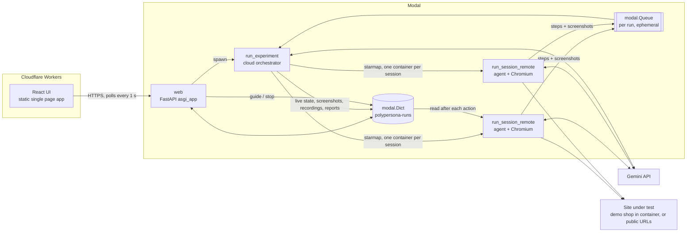
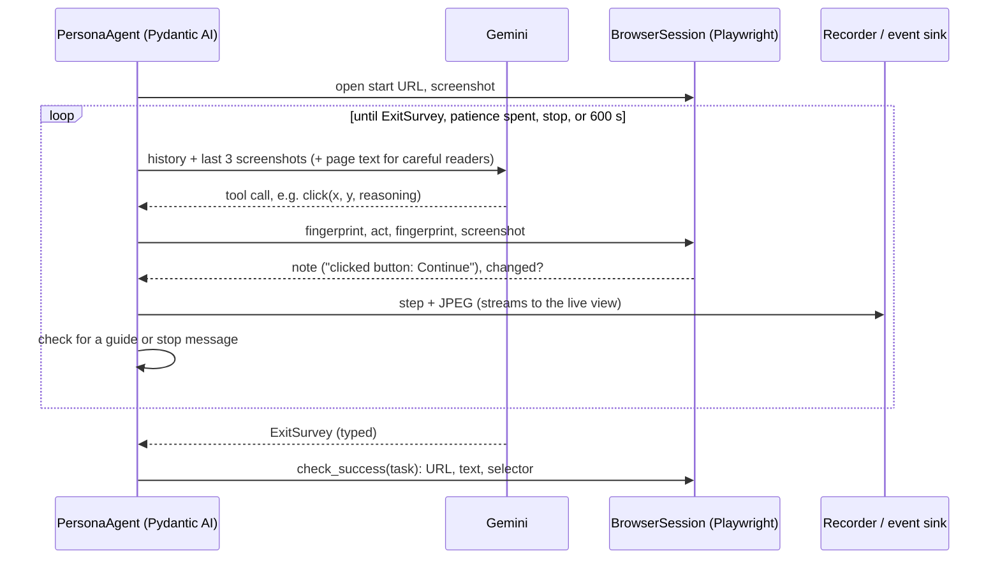

# PolyPersona architecture

PolyPersona runs a panel of AI persona agents against two variants of a website and turns what they
experienced into an evidence-backed A/B verdict. This document explains the parts, how data moves
between them, and the decisions behind the design.

## 1. System overview

Three runtimes, each doing what it is good at:

| Runtime | Runs | Why there |
|---|---|---|
| **Cloudflare Workers** | The UI, as static assets with single page app fallback | Free, global, instant deploys. The UI has no server logic. |
| **Modal** | The API, the orchestrator, and one container per agent session | Needs Python, Playwright and Chromium, minutes-long jobs, and fan out. Workers and serverless functions cannot do that. |
| **Gemini** | The model behind every agent | Multimodal, accurate at pointing on a screenshot, cheap at the Flash tier. |

The same Python code also runs fully locally through the CLI (`python -m polypersona run`), with or
without Modal, writing to `runs/` instead of the Dict.

## 2. The session: one agent, one browser, one container

A session is the unit of work and the unit of isolation: one persona, one variant, one fresh browser.

Key files: `persona_agent.py`, `browser.py`, `session.py`.

- **Tools.** `click`, `type_text`, `scroll`, `press_key`, `go_back` act on a 0 to 1000 coordinate grid
  over the screenshot. `record_observation(kind, severity, text)` is free and pins a reaction
  (bug, friction, confusion, delight, opinion) to the current step. The run ends when Gemini returns a
  valid `ExitSurvey`.
- **Behavioural personas.** Patience is a hard action budget enforced in the tool layer, not a
  suggestion. Device sets the viewport and mobile personas tap. Careful readers also receive the page
  text. A customer's real screen size from a CSV is used, clamped to 360 to 1440 by 600 to 900.
  Agents are never told they are in an A/B test.
- **Change detection.** Before and after each action the browser hashes URL, DOM, form values, focus
  and scroll position. A click that changes none of them is a dead click. Pixels are not used because
  carets and animations change them for no reason.
- **Completion is verified in code** from the final URL, visible text or a CSS selector. With no check
  configured the persona's own claim is used and the report says so.
- **Cost control.** A history processor keeps only the last three screenshots in context. Screenshots
  are JPEG quality 70.
- **Resilience.** Gemini calls back off on 429 and 5xx. A session has a 600 s wall clock limit. Any
  crash becomes a report with `outcome="error"`, never a failed run.
- **Recording.** Playwright records the page to webm with an injected cursor, which is hidden in the
  screenshots the agent sees so it cannot influence it.
- **Guide and stop.** After every action the agent checks a control key in the Dict. A guide message is
  delivered as "a friend looking over your shoulder says…", so the persona may decline it in
  character. Stop ends the session and the agent still answers the exit survey.

## 3. Orchestration

`orchestrator.py` is shared by the CLI and the cloud.

1. `plan(config)` builds the job matrix: personas × variants × repeats. Personas come from the
   built-in three, a generated audience, or full persona objects (uploaded CSV, saved custom personas).
2. `run_on_modal` calls `run_session_remote.starmap` so every job gets its own container, and pumps
   the run's `modal.Queue` into the `LiveBoard` while sessions are still running. `run_local` does the
   same with local browsers and a semaphore.
3. `judge` computes metrics in plain code (`metrics.py`: completion, actions, duration, dead clicks,
   backtracks, ease, trust, severity, errors, tokens) and only then asks the evaluator to interpret them.

`LiveBoard` (`live.py`) holds the run's live state and writes through a backend: `FsBackend`
(`runs/<id>/live.json` plus JPEGs, used by the CLI) or `DictBackend` (the Modal Dict, used by the web app).
Because state is written after every step, a crashed run still leaves its evidence behind.

### Storage layout in the Modal Dict `polypersona-runs`

| Key | Value |
|---|---|
| `index` | Summaries of the latest 200 tests (name, status, agents, completed, winner, sentiment, tokens) |
| `<run>/state` | The whole live state: config, sessions with steps, observations, controls, metrics, verdict |
| `<run>/<session>/<idx>.jpg` | Screenshot after step `idx` |
| `<run>/<session>/video` | webm recording |
| `<run>/<session>/report` | Final `SessionReport` JSON, used by ask-the-evaluator |
| `<run>/<session>/control` | A pending guide or stop message, removed when the agent reads it |
| `quota/<user>/<date>` | Tests started today by that account |

## 4. The evaluator

`evaluator.py` is a second Pydantic AI agent on a stronger model. It receives every session's path,
observations and exit survey plus the code-computed metrics, and it can open any screenshot with
`get_screenshot(session_id, step_idx)`. Its output type is `EvaluatorReport`: winner (or "no clear
winner"), confidence, rationale, issues merged across personas with `session#step` evidence,
per-persona notes and caveats. The same agent answers follow-up questions (`ask`).

Rules it is given: metrics are ground truth, every claim needs evidence, separate real defects from
persona taste, stay calibrated about small samples of simulated users.

## 5. HTTP API (`cloud.py`, served by `modal_app.py::web`)

| Method and path | Auth | Purpose |
|---|---|---|
| `POST /api/login` | none | Username and password to a signed 7 day session token |
| `GET /api/auth` | yes | Check a session |
| `GET /api/personas` | no | Built-in personas |
| `POST /api/personas/generate` | yes | Personas from an audience description (Gemini) |
| `POST /api/personas/from-rows` | yes | Personas from CSV rows: mapped in code when columns match, otherwise personified by Gemini |
| `GET /api/runs` | no | Test summaries |
| `POST /api/runs` | yes | Start a test (spawns `run_experiment`), limited to 10 personas, 3 repeats, 12 tests per account per day |
| `GET /api/runs/{id}` | no | Live state of a test |
| `GET /api/runs/{id}/sessions/{sid}/shots/{n}.jpg` | no | Screenshot |
| `GET /api/runs/{id}/sessions/{sid}/video` | no | Recording, with byte range support |
| `POST /api/runs/{id}/sessions/{sid}/guide` | yes | Suggest something to a running agent |
| `POST /api/runs/{id}/sessions/{sid}/stop` | yes | End a running agent's session |
| `POST /api/runs/{id}/ask` | yes | Question to the evaluator about a finished test |

**Auth model.** Accounts come from `POLYPERSONA_USERS`. A session token is
`user.expiry.HMAC-SHA256(user.expiry, POLYPERSONA_TOKEN)`, so there is no session store. The raw
`POLYPERSONA_TOKEN` is accepted as a master token. Reads are public because `` and `<video>`
cannot send headers and test ids are unguessable; everything that spends money is protected.

## 6. Customer data to personas (`population.py`)

A CSV is parsed in the browser (`ui/src/lib/csv.ts`). The UI shows what is in the file, picks a
representative sample stratified by tech savviness and device, and sends only the chosen rows.

- **Known columns** (`name`, `bio`, `goals`, `frustrations`, `tech_savviness`, `patience_steps`,
  `viewport`, `reading_style`, `products_bought`, `address`) are mapped in code, so a row always
  becomes the same persona and costs nothing. A 1 to 10 patience score becomes an action budget of
  10 to 40. Only city and country are taken from the address.
- **Unknown columns** are personified by Gemini, one persona per row, grounded in the row.

Personas carry `source` ("crm.csv row 14") so every agent traces back to a customer.

## 7. Front end (`ui/`)

React 19, Vite, Tailwind 4, react-router. Three places, so nobody gets lost:

| Route | Screen |
|---|---|
| `/` | Landing, with a journey matrix from the most recent test |
| `/login` | Sign in |
| `/workspace` | Your tests |
| `/new` | New test: what to compare, who tests it, name, Start test |
| `/tests/:runId` | One test: **Live** tab (tiles, sentiment split by variant, agent cards, journey matrix) and **Results** tab (verdict, KPIs, themes, funnel, metrics, issues with evidence, ask) |
| `/tests/:runId/agents/:id` | Live inspector for one agent: screen, scrubber, event log, journey checklist, guide and stop, recording |
| `/personas` | Persona directory, CSV upload, audience generator |

- `src/lib/api.ts` is the only place that talks to the API. `useRun` polls every second while a test
  is live and stops when it finishes.
- `src/lib/derive.ts` is the single definition of everything derived from raw data: agent state
  (starting, active, hesitating, done, blocked), journey stage (read from the page URL, so it works
  on any site), sentiment, funnel, and route builders.
- `src/lib/ui.tsx` holds shared components, including the sign-in gate used by every paid action.

## 8. Demo site (`site/`)

A single page coffee shop with hash routing, served from inside each agent container so no public
hosting is needed.

| Variant | What it is |
|---|---|
| `a` | Clean guest checkout. Contains two small real bugs the agents found unprompted. |
| `b` | Dark patterns: popup, forced account, "Error 422" on phone numbers, late handling fee, inverted buttons. |
| `c` | Plausible redesign of `a`: Buy now, email for the receipt, cart clears, but a pre-ticked subscription. |

## 9. Design decisions

- **Own tools on a general Gemini model, not the Computer Use tool.** Per-screen feedback is the
  product, and with Pydantic AI tools an observation is just another tool call in the same loop.
  Click accuracy turned out to be good on the 0 to 1000 grid. The browser sits behind one class, so
  swapping the control loop later touches nothing else.
- **Agent inside the container, not on a coordinator.** One Modal Function call holds the loop and
  the browser. Each action is an in-process Playwright call, so steps are fast and the laptop or API
  only waits. The trade-off is that the Gemini key lives in the container.
- **Numbers in code, words from the model.** The evaluator never produces a metric.
- **JSON across the Modal boundary.** Arguments and results are JSON strings and bytes, so local and
  remote library versions do not need to match.
- **A test is one page.** Earlier versions spread a run over three pages. Two tabs on one page removed
  the question "where do I look now".

## 10. Limits and honest caveats

- Simulated users tolerate friction differently from people. Use this to find problems early, not to
  replace research. Below three repeats per persona and variant, results are directional.
- The live view polls; it is not a push channel. Guide and stop take effect after the agent's next action.
- The Dict is a cache with a retention window, not a database. Long-term storage would move to a
  Volume or an external store.
- Sites with bot protection or logins are out of scope for the demo.
